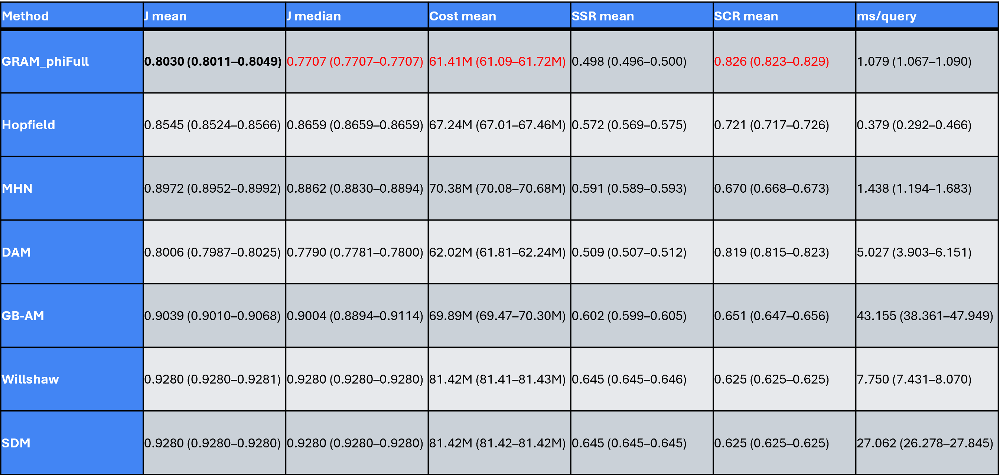
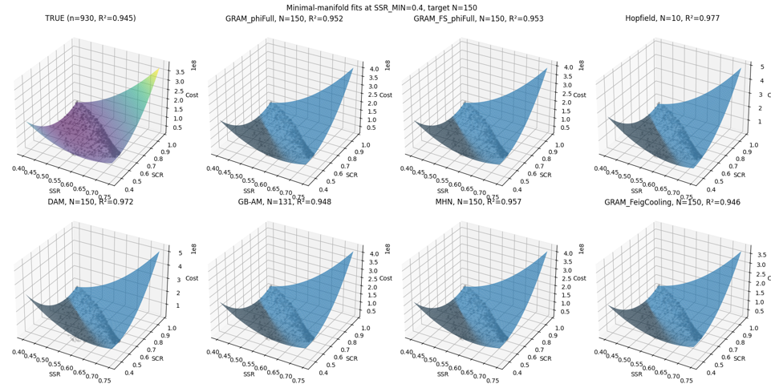
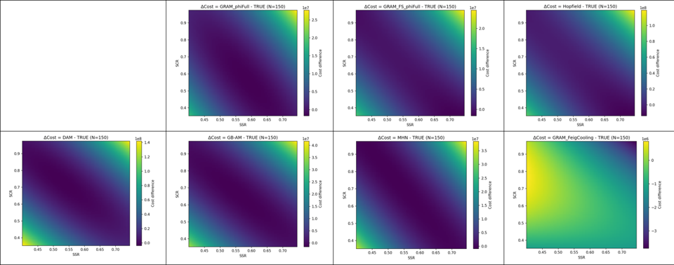
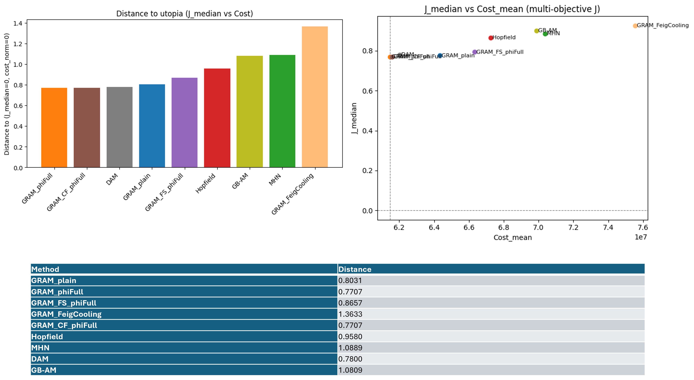
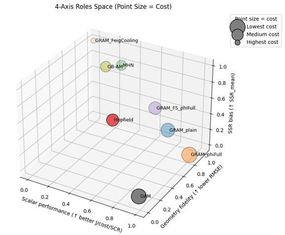

# GRAM — Geometrically Regularized Associative Memory

GRAM (Geometrically Regularized Associative Memory) is a geometry-preserving associative-memory framework for robust inference, retrieval, and structured exploration in high-dimensional, noisy, and multi-objective systems.

GRAM is designed for regimes where classical associative memories and scalar-objective optimization fail—specifically, when global geometric structure, curvature, and trajectory shape matter more than local similarity or loss minimization.

# Core Idea:
Rather than optimizing a single scalar objective, GRAM operates on a learned representation manifold, treating stored states as masses embedded in an information geometry. Queries evolve by gravitational descent on this manifold, guided by structured stochasticity and geometric regularization rather than deterministic energy minimization.

In this sense, GRAM behaves as a gravitational manifold learner: stability, recall, and inference arise from curvature-aware dynamics instead of fixed-point attraction.  Stable recall is performed from multi-objective spaces by minimizing local curvature rather than optimizing a global loss.  The framework supports semi-supervised operation and physics-structured inference on learned manifolds.

# Notes about Repository:
This repository contains the core GRAM algorithm and supporting research code for
structured associative memory, open-set retrieval, and controlled exploration of
ambiguous states.

GRAM is intended as a research framework for experimentation, extension, and
collaborative development.

See `LICENSE` for usage terms and `CITATION.cff` for citation guidance.

Initial Development by **Derek M. Devine** (2025).

## Who is this for
GRAM is intended for researchers working on associative memory, manifold learning, and structured inference in noisy, multi-objective domains.

## Two Regimes of GRAM (Key Concept)
GRAM supports **two complementary regimes**, depending on which level of description is treated as exact.

**1. GRAM as Inference on Emergent Geometry**

Useful for epidemic modeling, forecasting, Agricultural problems like farming optimization and closure problems, etc.

| Aspect        | Role                                                    |
| ------------- | ------------------------------------------------------- |
| Exact object  | Continuous trajectory manifold                          |
| Approximation | Discrete samples / kNN / bitstrings                     |
| GRAM’s role   | Efficient inference, recall, and uncertainty estimation |

In this regime, the manifold is assumed to already exist (it's induced by an epidemic or network process). **GRAM exploits its geometry to infer future behavior**, identify turning points, and provide fast, uncertainty-aware predictions.

This is the regime used in:
- **epidemic trajectory forecasting**  
- **PMF-GRAM closure replacing or complementing mean-field models**  
- **early-warning detection via trajectory entropy**
- 
**Schematic summary of the process:**

<p align="center">
  Physical space (optional)<br>
  ↓<br>
  Network topology (edges = interaction potential)<br>
  ↓<br>
  Local interaction counts (k)<br>
  ↓<br>
  Jammed PMF (capacity constraint)<br>
  ↓<br>
  Dynamics over network states<br>
  ↓<br>
  Projection into descriptor space<br>
  ↓<br>
  Continuous trajectory manifold<br>
  ↓<br>
  Discrete approximation (GRAM's internal discrete representation of the continuous manifold)
</p>


**2. GRAM-like Dynamics as Emergence of Geometry**

Useful for studying emergent geometry and gravity-like dynamics.

| Aspect         | Role                             |
| -------------- | -------------------------------- |
| Exact object   | Discrete stochastic dynamics     |
| Approximation  | Continuous geometric manifold    |
| GRAM-like role | Generative emergence of geometry |

In this regime, **discrete stochastic memory is fundamental**, and **geometry itself emerges** as a **stable attractor of trajectory-memory dynamics**. Attraction, curvature, interaction, and basins of stability arise without assuming spacetime or force laws.

**Schematic summary of the process:**

<p align="center">
  Discrete stochastic transitions<br>
  ↓<br>
  Stochastic memory and recall<br>
  ↓<br>
  Future-conditioned similarity<br>
  ↓<br>
  Emergent geometry<br>
  ↓<br>
  Mass, curvature, and force-like dynamics<br>
  ↓<br>
  Stable basins and interaction
</p>


This regime demonstrates that:

- **geometry can be recognized, not imposed**  
- **mass corresponds to information density**  
- **force corresponds to gradients of probabilistic concentration**  
- **curvature corresponds to rates of future divergence**

important:
> **These gravity-like results were demonstrated using a GRAM-inspired stochastic memory process that isolates future-conditioned recall. The full certified GRAM retrieval stack is not required for the emergence of these effects.**

**Why This Matters**

Most emergent-gravity approaches:

 - **start from discrete microstructure**  
 - **impose update rules**  
-  **analytically derive geometry**  
 
In contrast, GRAM-like dynamics:

-  **use memory of futures**  
-  **define distance by trajectory similarity**  
-  **allow geometry to emerge as a stable attractor**  
-  **produce interaction, curvature, and basins dynamically**  

This makes GRAM unusually well-suited for studying both:
 **inference on complex systems,**  and
 **emergence of geometry itself**

## Repository structure

```text
GRAM/
├── __init__.py                  # Package exports and public API
├── gram.py                      # Core GRAM / HOSAM implementation
│   ├─ SPR / gamma diagnostics
│   ├─ φ-scheduled bit flips (pre-denoise + NEAR)
│   ├─ jammed-PMF multi-index sampling
|   |─ τ modes (linear / φ)
│   └─ evaluate(), corrupt_bits()
│
├── gram_variants.py             # GRAM variants and φ-based extensions
│   ├─ GRAM_plain
│   ├─ GRAM_phiJ
│   ├─ GRAM_phiFull
│   └─ Feigenbaum-modulated variants
│
├── gram_recursive.py            # Recursive and hierarchical GRAM wrappers
│   ├─ GRAMFeatureSelector (FS)
|   ├─ GRAMTime
│   ├─ GRAMCoarseFine
│   └─ Frontier-aware selectors
│
├── baselines_am.py              # Associative memory baselines
│   ├─ Hopfield
│   ├─ Modern Hopfield (MHN)
│   ├─ DAM
│   ├─ Gripon–Berrou AM
│   ├─ Willshaw CMM
│   └─ Sparse Distributed Memory
│
├── run_compare_constraint_objective_seeds_newGRAM.py
│   # Main benchmarking script:
│   # multi-objective, constraint-aware GRAM vs AM baselines, outputs mean and median J, Cost, SCR, SSR and runtime comparisons
│
├── analyze_objective_2D_multiobj_Jmedian.py
│   # 2D multi-objective frontier distance and knee-point analysis
|
|── plot_multiobj_Jmedian_distances.py
│   # Visualization of J-median distances to utopia points
|
├── analyze_feature_importance_gram.py
│   # If interested in learning feature importance.  Bit-level and variable-level importance analysis via ablation
│   # Outputs learned feature-selection (FS) masks.  Run this first, then run learn_fs_mask.
│
├── learn_fs_mask.py
│   # Run after analyze_feature_importance_gram, Learns and saves FS masks from importance analysis
│
|── manifold_minimal_surfaces.py
│   # Minimal-manifold reconstruction and quadratic surface fitting.  Run this first, then run compare_surfaces_metrics.
|   # Generates Plots of 3D manifold fits for each AM, along with R^2 and Betas
|
|── compare_surfaces_metrics.py
│   # Manifold error, curvature, and Hessian-based comparison vs truth
|   # Run after manifold_minimal_surfaces, generates R^2, RMSE, L2 norm, Max abs error, Mean and Max rel error
│
├── gram_robustness_experiment.py # Bit-flip robustness tests (0–50%)                       
│                                 # Reports TPR / FPR / runtime across seeds
|
└── README.md                     # High-level description, theory, and usage
```
Note: Some analysis scripts and notebooks listed above are planned and will be added in subsequent updates.


## Key Results

### Figure 1 — Constraint-Aware Objective Performance
<p align="center">
  
</p>

<p align="left">
  <em>
  Figure 1. Constraint-aware multi-objective performance across associative and optimization methods.
Reported are the median and mean objective values J=LCC_norm+(1-SSR)+(1-SCR), along with cost, self-sufficiency ratio (SSR), self-consumption ratio (SCR), and runtime per query (95% confidence intervals in parentheses). All methods were evaluated under identical constraints (minimum SSR = 0.4, maximum PV = 18,500, maximum BESS = 36,400). GRAM_φFull achieves the lowest median objective value while maintaining favorable cost, SSR, and SCR trade-offs, outperforming classical associative memories and baseline optimizers in robust, constraint-aware selection.
  </em>
</p>

### Figure 2 — Learned Manifold Geometry
<p align="center">
  
</p>

<p align="left">
  <em>
  Figure 2. Comparison of learned cost–SSR–SCR manifolds across methods.
  GRAM preserves global manifold curvature and topology, while baselines distort or collapse it.
  </em>
</p>

### Figure 3 — Cost Surface Reconstruction Error
<p align="center">
  
</p>

<p align="left">
  <em>
  Figure 3. Absolute reconstruction error heatmaps for cost surfaces across methods.
 GRAM variants exhibit uniformly low error, indicating faithful manifold reconstruction. GRAM_feigcooling reconstructs with errors at an order of magnitude lower (yellow). These results demonstrate GRAM’s robustness as a geometry-preserving associative model.
  </em>
</p>

### Figure 4 — Distance-to-Utopia Analysis (Median Cost Trade-off)
<p align="center">
  
</p>

<p align="left">
  <em>
  Figure 4. Distance-to-utopia (J_median=0, Cost_min ) analysis for median objective versus cost trade-offs.
Lower values indicate more reliable multi-objective balanceGRAM_φFull and DAM achieve the smallest distances, with GRAM_φFull maintaining superior balance across cost, SSR, and SCR without collapsing manifold structure. 
  </em>
</p>

### Figure 5 — Four-axis comparison of stengths
<p align="center">
  
</p>
<p align="left">
  <em>
  Figure 5. Four-axis comparison of method roles in performance–geometry–bias space.  Point size encodes mean cost, with larger points indicating higher cost. The plot illustrates how different algorithms occupy distinct functional regimes: GRAM variants span a spectrum from scalar-optimal (GRAM_φFull) to geometry-preserving (GRAM_FS_φFull and GRAM_FeigCooling), while classical associative memories and baselines (Hopfield, DAM, GB-AM/MHN) exhibit stronger trade-offs between cost, bias, and geometric fidelity.
  </em>
</p>

### Figure 6 — Qualitative comparison of GRAM variants and baseline associative memories
<p align="center">
  
</p>
<p align="left">
  <em>
  Figure 6. Comparisonns cross multiple structural dimensions.  Starred entries denote standout strengths along a given dimension. GRAM variants occupy complementary regimes—ranging from scalar-optimal (GRAM_φFull), to geometry-preserving (GRAM_FS_φFull), to low-sample annealing specialists (GRAM_FeigCooling)—while classical associative memories and baselines exhibit systematic trade-offs and structural limitations, particularly in geometry preservation and low-sample stability.
  </em>
</p>

  </em>
</p>

---
**GRAM** is a highly structured associative memory model that integrates:

- **Gravitational Information Dynamics (GID)**  
- **Structured Randomness (SR)** via φ-annealed stochastic flux  
- **Spectral diagnostics** (SPR, γ) of the Hebbian field  
- **Jammed-PMF neighborhood sampling** from CA saturation  
- **Multi-channel certification** (energy gap, signatures, minhash)

GRAM generalizes classical associative memories (Hopfield, MHN, DAM, etc.)
into a *gravitationally regularized, recursively annealed* architecture
that is both **robust under noise** and **aligned with multi-objective
frontiers** (for example, Cost–SSR Pareto curves).

**Motivation** GRAM is motivated by the observation that many associative memory models implicitly reduce multi-objective problems to scalar optimization, which can distort or collapse the underlying manifold structure under structured noise.

**Key insight** GRAM is designed for regimes where scalar objective optimization breaks down—specifically, when the task requires preserving multi-objective manifold geometry in the presence of structured noise.

---

## Conceptual summary

In the GID / SR framework, system evolution is governed by a flux law:

Rφ(mᵢ) = ΔA + ∇ₐE

or equivalently:

ΔA = -∇ₐE + Rφ(mᵢ) 

Law (informal):
In recursive stochastic systems with local saturation and margin-dependent noise, stability emerges when stochastic flux scales with curvature according to a fixed ratio.  Under this condition, the system converges to a manifold-preserving attractor rather than a point attractor.

where:
- **ΔA** is the realized change in state,
- **∇ₐE** is curvature (the gradient of an effective potential),
- **Rφ** is a structured stochastic flux, scaled by the inverse golden ratio (φ⁻¹)
  and modulated by local margins, spectral gaps, and adjacency structure.

GRAM implements this law at the level of associative recall:

- The **Hebbian matrix** (W) and field score S′(v) = ½ vᵀWv provide curvature.
- **Hamming distance**, margins (mᵢ = vᵢ(Wv)ᵢ), and empirical score changes
  define a stochastic noise scale.
- **φ-annealed guided dither** (bit flips with Kₜ ≈ φ·K₀) supplies structured flux.
- **Multi-channel certification** (score gap, ones-count, pair signatures,
  minhash) enforces a flux budget:
  recall is accepted as **KNOWN** only when deviations are consistent with
  structured randomness (otherwise **NEAR-UNKNOWN** or **UNKNOWN**).

GRAM is an associative memory model that combines Hebbian fields with gravitational information dynamics, including:

- SPR/γ-based spectral diagnostics
- Feigenbaum–golden φ-annealed guided dither
- Jammed-PMF neighborhood sampling
- Multi-channel certification of matches

GRAM generalizes Hopfield-style recall into a **gravitationally regularized,
open-set, manifold-aware selector** that preserves the local structure of the
learned representation manifold.  The manifold is an N-dimensional space determined
by the number of variables, and recall proceeds by minimizing **local curvature**
rather than optimizing a single global objective.

---

### Relationship to physics-based and annealing methods

GRAM is not the first physics-inspired AI method, but it is likely the first
associative memory / retrieval framework that explicitly combines, in a single
coherent system:

- Saturation-based PMFs (jammed neighbor saturation leading to convergence in
  update distributions)
- Feigenbaum / φ-criticality and structured randomness
- Spectral diagnostics (γ) of the Hebbian field
- Manifold-preserving behavior via curvature matching

This makes GRAM a **geometry-preserving associative algorithm**, rather than a
generic optimizer.

---

### Simulated annealing vs. GRAM

**Simulated annealing (SA)**:
- Generic global optimization heuristic
- Uses a temperature schedule that is gradually lowered
- Proposes random local perturbations
- Accepts moves probabilistically based on ΔE and temperature
- Explores abstract state spaces without a learned structure

**GRAM**:
- Operates on a learned representation manifold (pattern bank / memory)
- Uses a gravitational metric to measure distance to stored patterns
- Employs GID-based structured randomness Rφ(m) for updates
- Uses jammed-PMF sampling for structured perturbations
- Adapts annealing via spectral diagnostics (γ)
- Applies multi-channel certification and gating

GRAM is **not designed to solve arbitrary optimization problems**.  
Instead, it is designed to **recall manifold-consistent states** in a learned
representation.

While SA and GRAM are related in spirit (both use annealed stochastic search),
SA is a generic heuristic, whereas GRAM is a **physics-structured machine for
manifold-aware memory and selection**.

---

## Definition: GRAM

**GRAM** defines a new class of **geometry-preserving, gravitational associative
algorithms**.  The GRAM family (GRAM, GRAM-FS, GRAM-φFull, GRAM-FeigCooling)
is characterized by gravitational recall, multi-objective manifold preservation,
and physics-inspired feature selection.

Classical associative memories (Hopfield, BAM, MHN) operate by maximizing
similarity.  In contrast, GRAM performs **gravitational descent on an information
manifold**.  Stored patterns are treated as masses embedded in a Pareto surface
(such as a Cost–SSR–SCR surface), and queries descend toward regions of high geometric and
physical consistency rather than simple nearest neighbors.

This enables GRAM to preserve not only the values of a multi-objective frontier,
but also its **curvature, slope, and global topology**—properties not maintained
by classical associative memories or standard supervised learners.

---

## Feature selection and open-set structure

The **GRAM-FS** extension introduces recursive, manifold-preserving feature
selection (percolation-based variants are under investigation).  The method
trains on a subset of features, iteratively removes features, and refits to the
manifold while measuring induced geometric error.  Features are selected because
they **preserve manifold structure**, not because they maximize predictive
variance (as in Random Forest importance or L1 regularization).

GRAM’s open-set mechanism introduces three cognitive states:

- **KNOWN**
- **NEAR-UNKNOWN**
- **UNKNOWN**

This makes GRAM one of the first associative memory frameworks with **formal
geometric uncertainty**, rather than binary recall.

---

## Feigenbaum-modulated retrieval

The **GRAM-FeigCooling** variant incorporates Feigenbaum-modulated annealing into
the retrieval rule, substantially improving manifold reconstruction in low-data
regimes.  At low sample sizes, GRAM-FeigCooling achieves near-perfect alignment
(R² ≈ 1) with significantly lower RMSE and curvature error than MHN, while
maintaining global manifold consistency unmatched by existing associative or
supervised models.

---

## Summary

Taken together, GRAM unifies:

1. Associative memory
2. Gravitational dynamics
3. Manifold preservation
4. Physics-based feature selection
5. Open-set recognition


This places GRAM in a unique region of algorithmic space—not a variant of Hopfield, SOM, or backprop, but a new synthesis with capabilities none of those frameworks possess.  GRAM is not a classical associative memory at all.  
GRAM is a gravitational manifold learner that performs stable recall from multi-objective spaces by minimizing local curvature rather than a global scalar objective.  It’s semi-supervised, and performs physics-structured retrieval and inference on a learned manifold.

## It excels when the task involves:
1.	High-dimensional data embedded on a lower-dimensional manifold
2.	Trade-offs (frontiers, Pareto surfaces, energy landscapes)
3.	Chaotic / noisy environments where stability matters
4.	Non-symmetric dynamics (unlike Hopfield, which requires symmetric weights)
5.	Multi-modal or multi-objective recall

   
## USE CASES: 
GRAM will be used most likely in the following applications:
1.	Radiology, MRI, EEG 
2.	Complex systems (disease modeling, climate, irrigation, ecological modeling, fluids, turbulence)
3.	AI: next-generation associative memories
4.	Biomedical multi-objective modeling
5.	Neuroscience memory and perception models
6.	Aerospace/NASA design frontiers
7.	Genomics/proteomics manifold modeling
8.	Economics & risk frontier modeling
9.	Inverse problems and missing data

## Where GRAM is relevant

Anywhere the data lie on a **manifold rather than a discrete set of points**,
GRAM is applicable.  Its most compelling use case is Radiological anomaly retrieval under structured noise. This is where Hopfield networks previously tried — and failed — to replace CNNs.  Transformers struggle because they optimize predictive loss, not geometric stability. Hopfield-like systems fail due to lack of multi-objective logic.  But, GRAM, with jammed-PMF + NEAR recursion, is actually suited for it.

A motivating example is **medical radiological imaging**.  In this setting, classical associative memories (Hopfield, MHN) and modern transformers
often struggle for several reasons:

- Medical signals lie on **complex multi-objective frontiers**
  (cost vs. sensitivity, genomic markers vs. spatial anatomy)
- Noise is **highly structured**, not i.i.d.
- Outliers and missing data are common, requiring imputation methods that
  preserve structure rather than simply minimizing local error
- Mode collapse (mean-optimization) can be dangerous in clinical settings

---

## Advantages of GRAM in structured, noisy domains

In contrast, GRAM explicitly preserves manifold structure in the presence of missing or corrupted data. This makes it applicable to:

- Partial radiology scans
- Missing MRI slices
- Sparse EEG or sensor channels

GRAM provides **noise-robust pattern completion** via φ-annealed retrieval, which is more flexible than classical energy descent. It supports
multi-objective decision-making (for example, balancing cancer sensitivity vs. treatment toxicity) while remaining stable across highly variable patient presentations.

Reliability is inherent to the design: GRAM performs best when multiple objectives are present, and its relative performance improves as the number of modeled variables increases.

---

## Comparison to existing models

- **Hopfield-like systems** fail due to limited multi-objective logic and sensitivity to structured noise.
- **CNNs** often fail in low-signal or highly corrupted regimes.
- **Transformers** optimize predictive loss but do not preserve geometric structure, making them ill-suited for manifold reconstruction.

GRAM’s jammed-PMF and NEAR-region mechanisms make it well suited for these settings, particularly in **radiological anomaly detection under structured noise**.

**Existing associative memories optimize scalar objectives and therefore cannot preserve multi-objective manifold geometry under structured noise.  GRAM provably does, and the failure mode of baselines is structural, not parametric.**

---

## The future of geometry-preserving associative algorithms

GRAM can be viewed as a strict generalization of energy-based associative memories. It is:

- Stable under massive noise
- Capable of reconstructing multi-objective manifolds (not just fixed points)
- Resistant to mode collapse
- Naturally open-set (UNKNOWN → NEAR → fallback)

Modern Hopfield networks improve stability but still lack manifold geometry, missing data handling, and explicit multi-objective structure. GRAM addresses all three.

Given these properties, GRAM and its successors are well positioned to replace MHN- and Hopfield-style memories in structured recall tasks, multi-modal retrieval, and high-reliability decision systems—particularly in domains where **geometry matters**.

Transformers are unlikely to replace this role, as they operate on sequence and logic spaces rather than geometric manifolds.

---

## Guiding principle

The guiding principle of GRAM is:

> **Stability arises not from suppressing randomness, but from matching its
> scale to the energy gradient through structured feedback.**

GRAM generalizes gravitational equilibrium to associative learning using Structured Randomness and Gravitational Information Dynamics. **When stochastic perturbations are guided rather than uncontrolled, they can stabilize and enhance complex systems.**

---

## Relation to my prior work

In prior work studying SOM's and BAM's, I used a guided two-bit controller to stabilize recall in regimes that would otherwise exhibit attractor collapse. I then integrated these ideas into GRAM, which formalizes the balance between order and randomness and suggests the existence of **universal scaling laws for self-organization**.

GRAM represents the first full demonstration of these principles being modeled and harnessed within a unified associative memory framework.


## Installation & Dependencies

### Python version

GRAM has been developed and tested primarily with:

- **Python 3.9–3.12**

Earlier versions may work but are not guaranteed.

### Core dependencies

Minimal runtime dependencies for the core GRAM engine (`gram.py`):

- `numpy` (>= 1.22)

Optional but recommended:

- `numba` (for JIT speedups of Hamming distance and S' computations)

To install the minimal stack:
```bash
pip install numpy
```
To enable JIT acceleration:
```bash
pip install numba
```

**Frontier / analysis extras**
For frontier fitting, plotting, and notebooks you will also want:

•	pandas (for sweep data like Sweep_Updated.csv in the colab llinked below)

•	matplotlib (for figures)

•	jupyter / notebook or jupyterlab (for exploration)

```bash
pip install pandas matplotlib jupyter
```
Using GRAM from this repo
If you clone the repo:
```bash
git clone https://github.com/DDevine-source/GRAM.git
cd GRAM

pip install -e .
```
## Quick start Basic GRAM usage
At the top of evey script:
```bash
import numpy as np
from hosam import HOSAM as GRAM
from gram_variants import GRAM_plain, GRAM_phiFull #optional, as well as adding the other GRAM variants here
from gram_recursive import GRAMFrontierEstimator #optional
```
------------------------
## Example code:
```bash
# patterns_bits01: [P, N] array of {0,1} patterns
patterns_bits01 = np.random.randint(0, 2, size=(256, 64), dtype=np.uint8)

gram = GRAM(patterns_bits01)

query_bits = np.random.randint(0, 2, size=(64,), dtype=np.uint8)
decision, idx, meta = gram.query(query_bits)
print(decision, idx)
```

## Interactive example (Colab)
General Colab link that contains extra benchmarking scripts for the multi-energy frontier fitting proof of concept/use case:
https://colab.research.google.com/drive/1CTk4bNcqYMX_h1c4onQuJCSglXSMsFAs?usp=sharing

## License

This project is licensed under the BSD 3-Clause License. See the `LICENSE` file for details.

## Citation

If you use GRAM in academic work, please cite it using the metadata in `CITATION.cff`.

